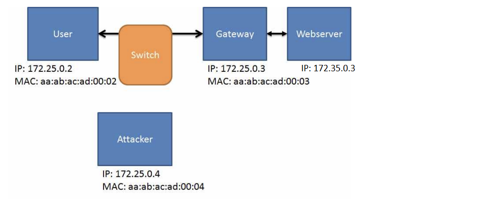
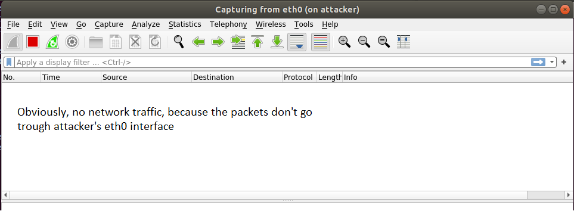
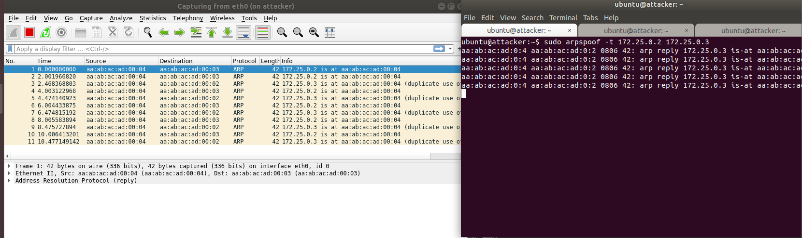
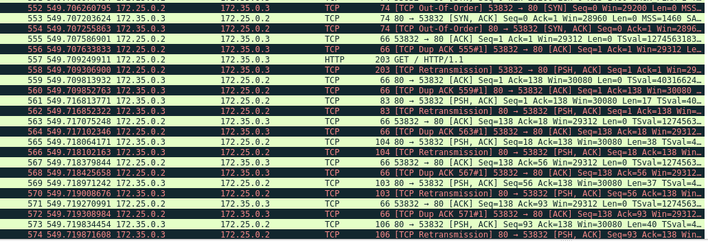
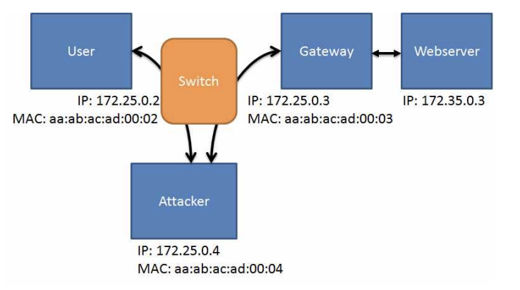

# **ARP Spoofing**

`Author: adi7312`

In this post we will discuss in detail *arp spoofing* - what is it, how to conduct this attack and how to defend against it.

## **1. What is ARP?**

*Address Resolution Protcol* (ARP) is network protocol that maps logic addresses at third ISO/OSI layer (network layer) to physical addresses at second ISO/OSI layer (data link layer)

## **2. How ARP protocol works?**

1. To determine physical address of target host the **ARP Request** is being send to all hosts that are in the same network. ARP Request cotains infromation about: logical address of target host and phyiscal address of source host.
2. **ARP Response** is being send only by the host, which has the logical address contained in ARP Request. Response contain: physical and logical address of target host.
3. Received physicall address is stored in **ARP table** and paired with logical address of target host. Untill we clear the ARP table it is not necessary to discover again the physical address of target every time.

## **3. What is and how to conduct ARP spoofing?**

ARP spoofing is type of cyberattack that allows the threat actor to eavesdrop the network traffic in local area network.

As an example I will use Labtainers exercise. Labtainers is an evironment where we can conduct some interesting exercises, for example: arp-spoof, buffer overflow etc. You can read more about it here: [Labtainer](https://nps.edu/web/c3o/labtainers).

After we set up enivornment, we can start doing arp spoofing. Our aim is to forge ARP protocol to fool the system. It can be easily done with *arpspoof* utility which is downloaded with *dsniff* package. Before that let's launch wireshark on eth0 interface.

    wireshark -ki eth0

Notice that if we download .html file from server (172.35.0.3) as a user (172.25.0.2), we will not see any traffic, it's obvious because the traffic is only between that two entities, we haven't made arp spoof yet (you can see visualisation of that siutation below).

Everyone waited for that moment, now we will conduct arp spoofing. On attacker terminal we use `arpspoof` utility:

    sudo arpspoof -t <User IP> <Gateway IP>

On second attacker terminal we use:

    sudo arpspoof -t <Gateway IP> <User IP>

Now we can see in Wireshark that some network traffic appeared, moslty we can see some ARP requests and responses.

Now on user's terminal we will write: `wget 172.35.0.3` to download .html file of that page. What's interesting in Wireshark now we can see TCP and HTTP protocols related to activity that user conducted. So we can state that arp spoofing allowed us to conduct successful Man-in-the-Middle attack (MITM attack) - we can eavesdrop the network traffic between the user and gateway!

Below you can see visualisation of our MITM attack:

## **4. How to defend againt ARP spoofing?**

To resolve the problem of ARP spoofing we can:

* Implementing static ARP tables - highly effetive againt ARP spoofing but it requires a lot of work
* Switch Security - most of modern switches have feature designed to mitigate ARP spoofing, known as Dynamic ARP Inspection (DAI), that feature drops the suspicious/malicious packets
* Physical security of facility - ARP messages are not routed beyond the boundaries of the local network, so attackers must be in physical proximity to the victim network or already have control of a machine on the network.
* Network segmentation and isolation

