# **WCYB - Projekt nr 2 - Konfiguracja usługi VPN**

**Autorzy**: Adrian Zalewski [gr.104], Wiktor Zawadzki [gr.104]

**Cel**: Skonfigurować rozwiązanie VPN, w którym  serwer VPN pełni rolę bramy do sieci Internet.

Nasze rozwiązanie jest oparte na infrastrukturze chmurowej ***Digital Ocean*** oraz na protokole komunikacyjnym ***WireGuard***.

- [**WCYB - Projekt nr 2 - Konfiguracja usługi VPN**](#wcyb---projekt-nr-2---konfiguracja-usługi-vpn)
  - [**1. Utworzenie serwera Ubuntu w serwisie DigitalOcen**](#1-utworzenie-serwera-ubuntu-w-serwisie-digitalocen)
  - [**2. Konfiguracja VPN od strony serwera**](#2-konfiguracja-vpn-od-strony-serwera)
  - [**3. Konfiguracja od strony klienta**](#3-konfiguracja-od-strony-klienta)
  - [**4. Testy usługi VPN**](#4-testy-usługi-vpn)
    - [**4.1. IP Address Test**](#41-ip-address-test)
    - [**4.2. DNS Leak Test**](#42-dns-leak-test)
    - [**4.3. Wireshark**](#43-wireshark)
    - [**4.4 Działanie na urządzeniach mobilnych**](#44-działanie-na-urządzeniach-mobilnych)
  - [**5. Podsumowanie**](#5-podsumowanie)

## **1. Utworzenie serwera Ubuntu w serwisie DigitalOcen**

**Cel:** Stworzenie serwera ubuntu korzystając z infrastruktury chmurowej *DigitalOcean*.

W serwisie *DigitalOcean* tworzymy nowy *droplet*, wybieramy Ubuntu.

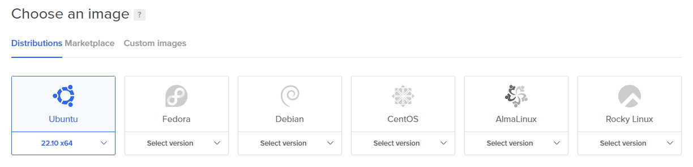

Następnie wybieramy *datacenter* oraz dodajemy klucz SSH (rozwiązanie to jest bezpieczniejsze, niż standardowe haslo), robimy to w następujący sposób. W terminalu wpisujemy polecenie:

    ssh-keygen

Wygenerował nam się klucz *ssh* otwieramy plik w którym zapisaliśmy owy klucz (publiczny) i jego całą zawartości kopiujemy do naszego *Droplet'u*.

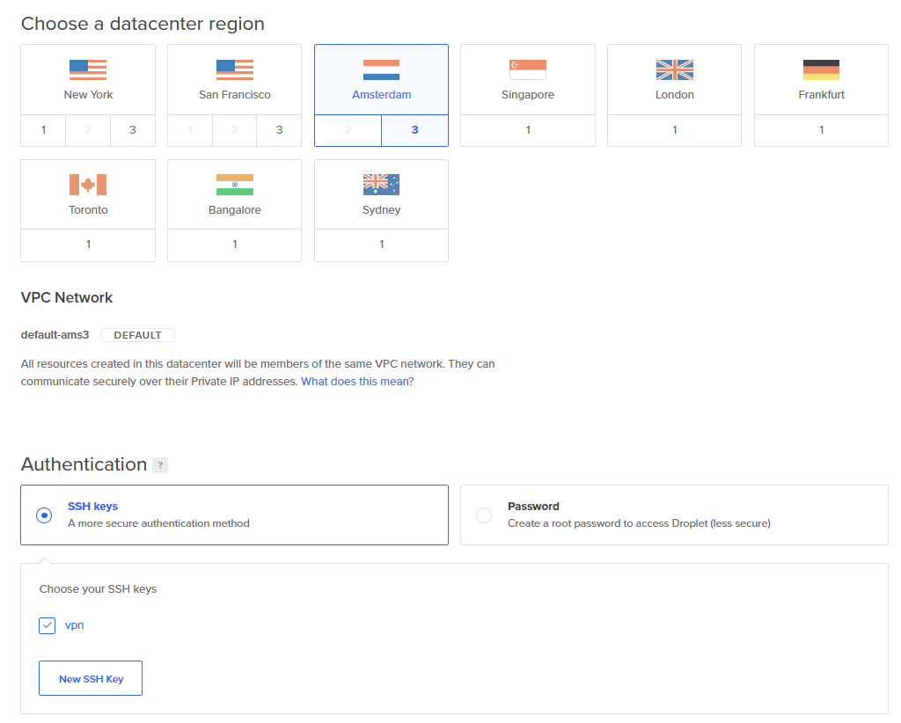

Możemy teraz zakończyć tworzenie serwera, przejdziemy teraz do jego konfiguracji.

## **2. Konfiguracja VPN od strony serwera**
**Cel:** Skonfigurowanie serwera VPN.

Wchodzimy w konsolę naszego serwera.

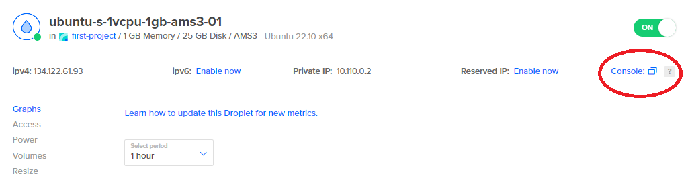

W pierwszej kolejności aktualizujemy wszystkie narzędzia i pakiety poleceniem:

    sudo apt-get update -y && apt-get upgrade -y

Następnie instalujemy pythona i ansible:

    sudo apt install -y python3-virtualenv

Pobieramy ***Algo VPN*** poleceniem:

    git clone https://github.com/trailofbits/algo

Następnie zmieniamy katalog na algo, robimy to poleceniem `cd algo`, następnie instalujemy tzw. *dependencies*:

    python3 -m virtualenv --python=/usr/bin/python3 .env

    source .env/bin/activate

    python3 -m pip install -U pip virtualenv

    python3 -m pip install -r requirements.txt
   

Następnie edytujemy plik *config.cfg* i ustawiamy nazwy użytkowników dla tych co będą korzystać z VPN'a:

    nano config.cfg

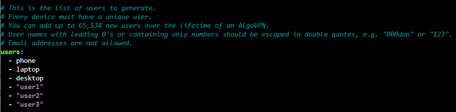

W tym samym pliku wyszukujemy *unattend_reboot*, zmieniamy wartość wyrażenia *enabled* z *false* na *true*. Robimy to po to żeby nasz serwer VPN był bezpieczniejszy. Ustawiamy również czas lokalny w jakim czasie będą mogłyby występować potencjalne uaktualnienia *Algo VPN*.

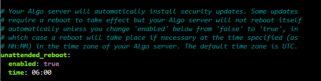

Aby zapisać plik należy użyc klawiszy *Ctrl+O*, aby wyjść z powrotem do terminala należy użyć *Ctrl+X*. Następnie stawiamy serwer. Używamy polecenia:

    ./algo

Jako dostawcę usługi ustawiamy nasze Ubuntu więc wybieramy opcję nr 12

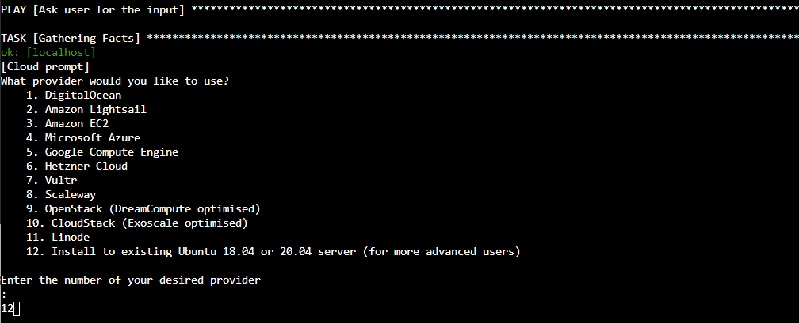

Następne pytania dotyczą tego czy urządzenia MacOS/iOS mogą korzystać z *Command on Demand*. Funkcja Connect On Demand umożliwia systemowi automatyczne uruchamianie lub zatrzymywanie połączenia VPN po podłączeniu do sieci komórkowych/ Wi-Fi. My nie pozwolimy na tą czynność, dajemy więc dwa razy *N*.

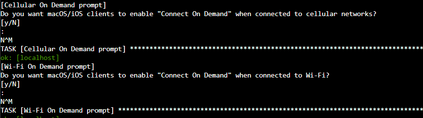

Następne pytanie dotyczy tego czy chcemy zachować klucze PKI. Ta funkcja daje możliwość dodawania użytkowników do pliku z konfiguracją po zakończeniu konfiguracji. Jest to jednak mniej bezpieczne, dlatego lepiej dodawać użytkowników tylko podczas początkowego procesu konfiguracji. My jednak będziemy chcieli skorzystać z tej funkcji, zatem wpisujemy *y*.

Następne pytanie dotyczy tego czy chcemy żeby nasz VPN blokował reklamy, oczywiście wpisujemy *y*.

Ostatnie pytanie dotyczy tego czy chcemy aby każdy użytkownik miał własne konto. Wpisujemy *y*.

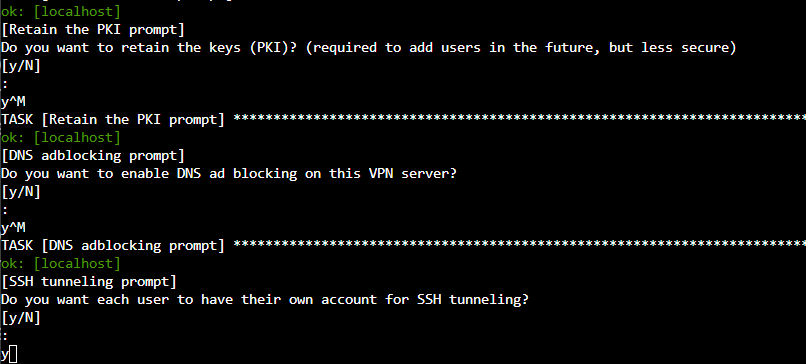

Musimy teraz podać adres IP naszego serwera - oczywiście aktualnie jesteśmy na tym serwerze, wię wpisujemy frazę *localhost*. Następnie musimy podać publiczne IP, które jest dostępne na DigitalOcean, w ustawieniach naszego Dropletu.

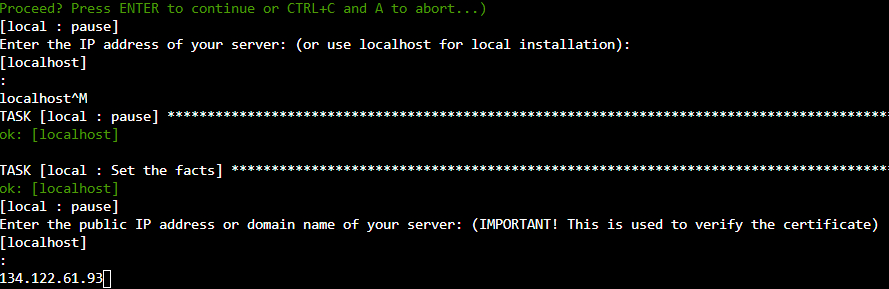

Po paru minutach oczekiwania, konfiguracja serwera dobiega końca.

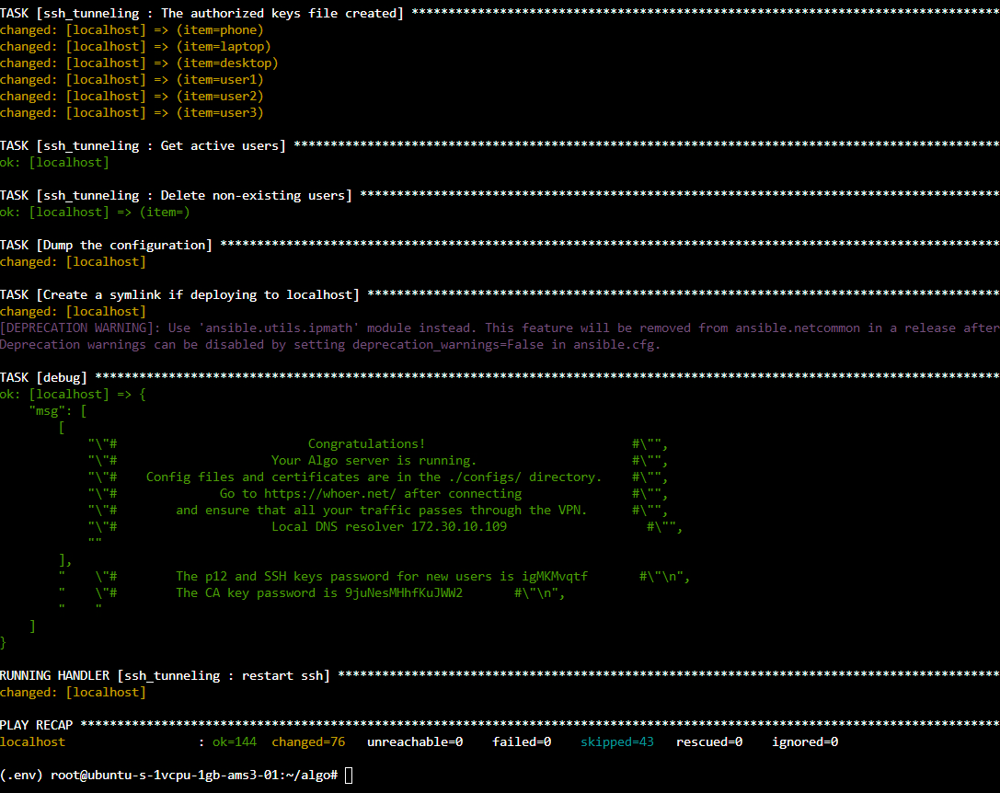

## **3. Konfiguracja od strony klienta**

**Cel:** Konfiguracja usługi VPN po stronie klienta.

Pobieramy *WireGuarda* po stronie klienta, my pobierzemy wersję na Windowsa i od razu zainstalujemy, następnie korzystając z programu *Filezilla* pobierzemy pliki przeznaczone do konfiguracji (folder *configs*). 

Na początku podajemy adres naszego dropleta (tj. 134.122.61.93), jako username podajemy *root* (tak ustawiliśmy na *DigitalOcean*), port ustawiamy na 22 (dlatego, że korzystamy z SFTP) i logujemy się. Połączenie jednak zakończy się niepowodzeniem, gdyż nie podaliśmy wygenerowanego na samym początku klucza prywatnego, musimy więc go dodać. Wchodzimy więc w ustawienia, zakładka *stfp* i dodajemy klucz.

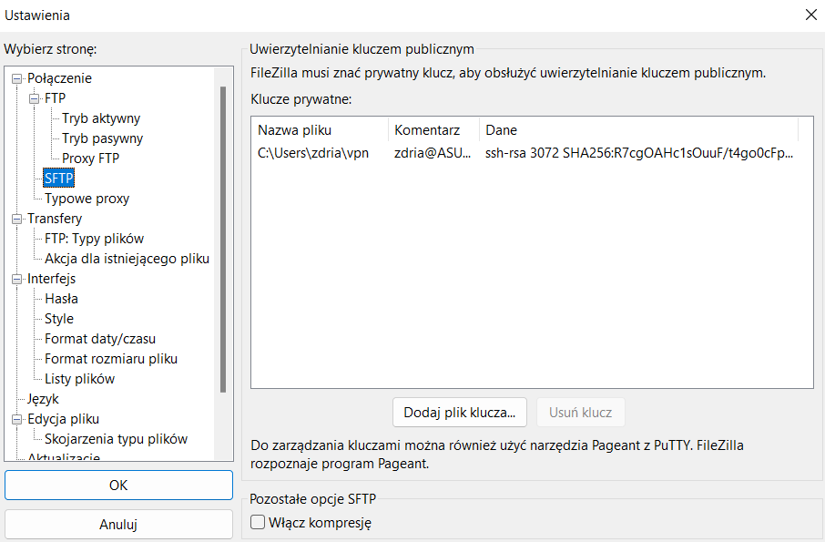

Następnie ponownie logujemy się, tym razem pomyślnie. Pobieramy folder *configs*
Następnie kompresujemy pobrany folder do formatu *.zip*.

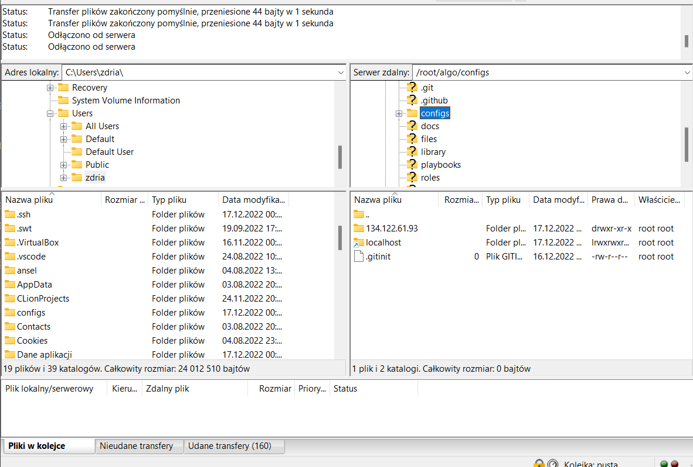

W WireGuardzie importujemy tunele z pliku *configs.zip*. Po zaimportowaniu tuneli aktywujemy naszego VPN'a i sprawdzamy czy działa.

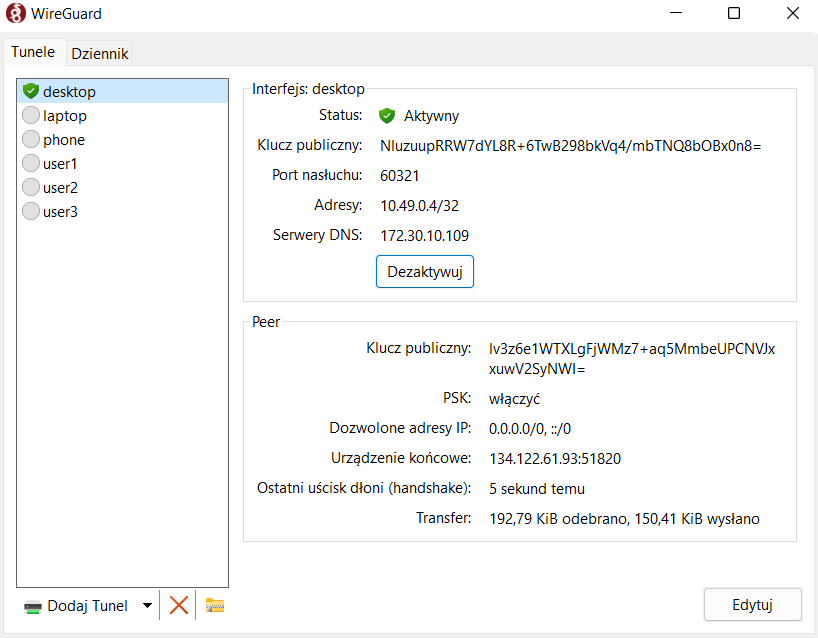

Jak widać na powyższym obrazku wydaje się, że wszystko działa. Dla pewności wykonamy jeszcze parę testów.

## **4. Testy usługi VPN**

**Cel:** Sprawdzenie poprawności działania skonfigurowanej usługi VPN.

### **4.1. IP Address Test**

Korzystamy z platformy whoer.net. Sprawdzamy IP strony przed włączeniem VPN:

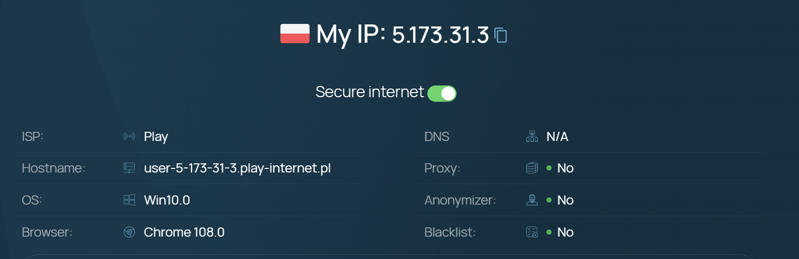

Teraz uruchamiamy VPNa:

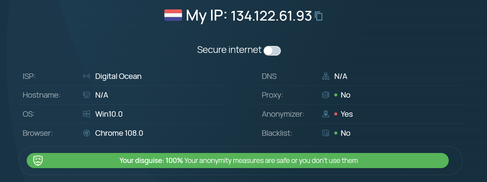

Jak widzimy usługa działa poprawnie, IP uległo zmianie i wskazuje na nasz holenerski *datacenter*.

### **4.2. DNS Leak Test**

Korzystamy z strony *dnsleaktest.com*. Jeśli dowolny z serwerów, wymienionych w rezultacie testu, nie jest dostarczony przez usługę VPN oznaczać to będzie, że mamy wyciek naszych danych na niepożądane serwery.

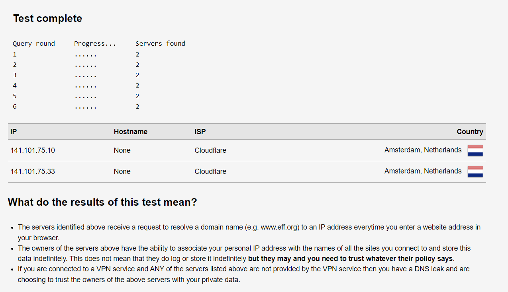

Wynikiem tego testu są 2 holenderskie serwery Cloudflare, które odpowiadają za działanie naszego *Dropletu*, a zarazem naszego serwera VPN, żadne inne serwery nie pojawiły się w teście, zatem nasza usługa jest skonfigurowana poprawnie.

### **4.3. Wireshark**

W programie *Wireshark* możemy zobaczyć że rzeczywiście przechodzimy przez serwer VPN oraz że komunikacja oparta jest na protokole *WireGuard*.

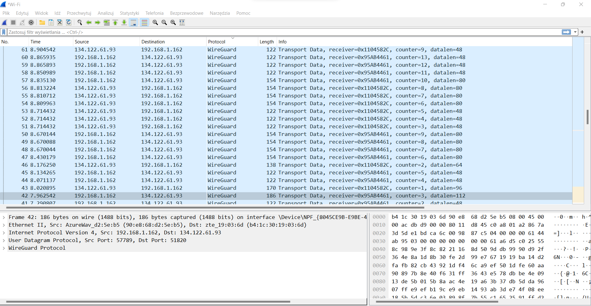

### **4.4 Działanie na urządzeniach mobilnych**

W celu sprwadzenia czy nasze rozwiązanie działa na urządzeniach mobilnych pobieramy na telefonie aplikację
Wireguard. Trzeba teraz zimportować tunele, w tym celu wygenerujemy specjalny kod QR. Instalujemy więc
narzędzie qrencode:

    sudo apt install qrencode

Bierzemy któryś z plików konfiguracyjnych, my weźmiemy phone.conf i generujemy nasz kod QR.

    qrencode -t ansiutf8 -r "phone.conf"

Skanujemy teraz na telefonie w aplikacji WireGuard skanujemy ten kod. Pomyślnie zimportowaliśmy tunel,
VPN jest gotowy do użytku, sprwadźmy czy działa. Na poniższym obrazku widzimy że wszystko działa tak jak
trzeba. 

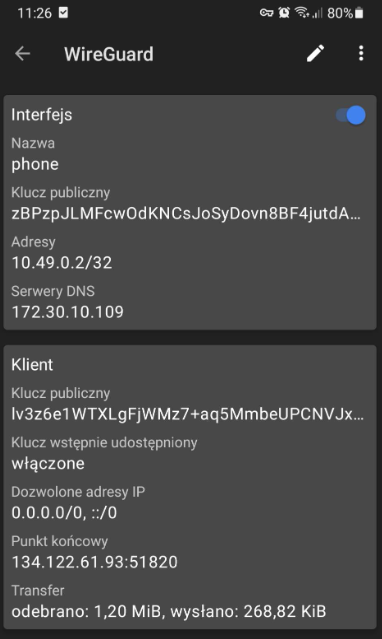

## **5. Podsumowanie**

Podczas wykonywania zadania nauczyliśmy się:
* Jak korzystać z infrastruktury chmurowej *DigitalOcean*
* Generować klucze SSH
* Implementować VPN zarówno po stronie serwera jak i klienta
* Jak testować poprawność działania usługi VPN

Rozwiązanie VPN pomaga nam wzmocnić naszą prywatność w sieci, chroni naszą tożsamość online, ukrywając adres IP, i pozwala na bezpieczne korzystanie z np. publicznych hotspotów Wi-Fi.